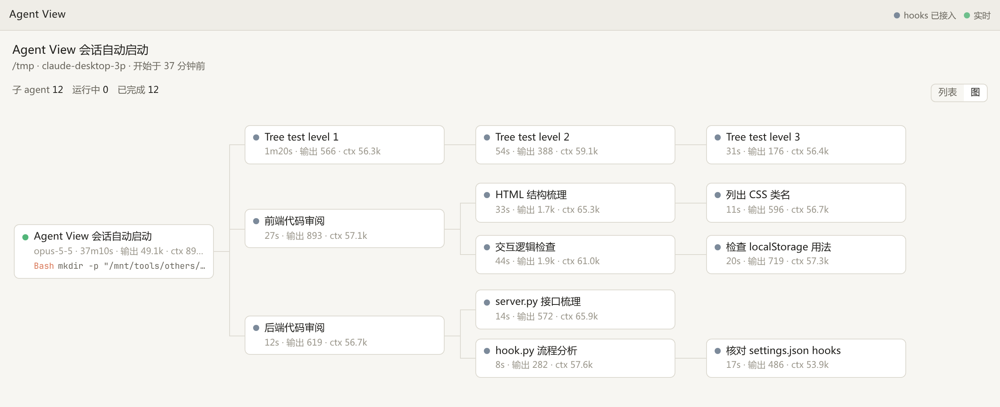
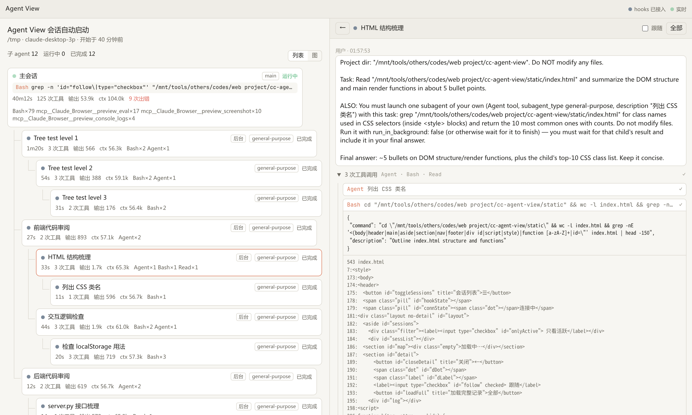

# Agent View

A local dashboard for Claude Code sessions and their subagents. It opens inside
the Claude Desktop Code tab's Browser pane, and it also works in any browser.



- **Agent map**: shows the main session and its subagents as a tree, based on
  who spawned which subagent. Switch between an indented list and a
  left-to-right graph with the 列表 / 图 toggle (remembered per browser). Each card shows status (running / waiting /
  done / stale), the tool currently running, elapsed time, tool call count,
  output tokens, context length and error count.
- **Transcript**: click a card to see that agent's messages, thinking and tool
  calls with their results. The transcript follows new output live.
- **Live updates** are pushed over SSE.



Stdlib Python 3 only, nothing to install.

## Data sources

| Source | Provides | Required? |
|---|---|---|
| `~/.claude/projects/**/*.jsonl` and `subagents/agent-*.jsonl` + `.meta.json` | tree structure, history, tokens, tool calls | Yes. Polled once per second. |
| hooks → `hook.py` → `POST /event` | precise state: waiting for permission, turn finished, subagent stopped | No, but recommended |

## Usage

1. Start the server. Pick one of these:
   - In Desktop, open the Browser pane and choose the `agent-view` config
     (from `.claude/launch.json`), or ask Claude to open it. The config runs
     `preview.py`, a small proxy on a port Desktop picks. It forwards to the
     server on 7777 and starts that server first if it is not running, so the
     pane works whether the hooks started the server already or not.
   - Keep it running permanently with `agent-view.service` (see the comments at
     the top of that file), or let the hooks start it (below).
   - Or run `python3 server.py` by hand and open http://127.0.0.1:7777.
2. (Optional) Install the hooks:
   ```bash
   python3 install_hooks.py            # writes ~/.claude/settings.json and backs it up first
   python3 install_hooks.py --dry-run  # preview only
   python3 install_hooks.py --uninstall
   ```
   The hooks run with `async: true`, so they never block Claude. Sessions that
   are already running may need a restart before the hooks take effect.

   With the hooks installed, the server starts itself: on `SessionStart` and
   `UserPromptSubmit`, if nothing is listening on the port, `hook.py` launches
   `server.py` detached from the session (log: `~/.local/state/agent-view.log`).
   Other events never start it; they are dropped silently while it is down. Set
   `AGENT_VIEW_AUTOSTART=0` to turn this off.

   The installer also adds a `SessionStart` hook, `autopreview.py`, that makes
   the preview available in every project. In Desktop sessions it adds an
   `agent-view` entry to the project's `.claude/launch.json`, so you can start
   it from the Browser pane with one click. It creates the file if needed and
   adds it to `.git/info/exclude`. An existing file keeps its other entries.
   A `launch.json` that is committed to git is never touched.

   Desktop only runs a session's hooks after you send a message in it. To cover
   the time before that, the server watches Desktop's session records
   (`~/.config/Claude*/claude-code-sessions`, or `AGENT_VIEW_DESKTOP_SESSIONS`).
   When you create a session in a new folder, the entry appears there within a
   few seconds. Worktree and archived sessions are skipped. For projects that
   only have CLI transcripts, run `python3 autopreview.py --all` once
   (`--all --dry-run` lists them first).

   With `AGENT_VIEW_AUTOPREVIEW=auto` the hook also tells Claude to open the
   preview before its first reply, since only a tool call can open the pane.
   `AGENT_VIEW_AUTOPREVIEW=0` turns the hook off entirely.
   Uninstalling the hooks leaves the `launch.json` entries in place.

The server listens on `127.0.0.1` only, since transcripts can contain sensitive
content. Environment variables: `AGENT_VIEW_PORT`, `AGENT_VIEW_HOST`,
`AGENT_VIEW_URL` (the address `hook.py` posts to), `CLAUDE_CONFIG_DIR`.

## Notes

- The jsonl format is not a stable public interface; parsing may need updates
  after Claude Code upgrades. All parsing lives in `Transcript._feed` and
  `render_entry` in `server.py`.
- Without hooks, status is inferred from transcripts. "Waiting for permission"
  can't be detected that way and shows as running.
- Large transcripts only load the last 3 MB / 400 items by default. Click "全部"
  (all) to load everything.

## License

MIT, see [LICENSE](LICENSE).
